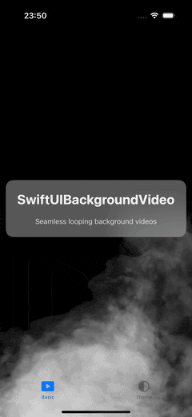
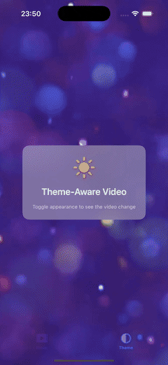

# SwiftUIBackgroundVideo

[](https://img.shields.io/badge/Swift-5.5+-orange?style=flat-square)
[](https://img.shields.io/badge/Platforms-iOS-green?style=flat-square)
[](https://img.shields.io/badge/Swift_Package_Manager-compatible-orange?style=flat-square)
[](LICENSE)

Seamless looping background videos for SwiftUI-because `VideoPlayer` can't loop and nobody wants 80 lines of AVPlayerLooper boilerplate.

<p align="leading">
  &nbsp;&nbsp;&nbsp;&nbsp;
</p>

## Why SwiftUIBackgroundVideo?

SwiftUI's native `VideoPlayer` can't loop videos or hide controls-it's designed for interactive playback, not backgrounds. The standard fix requires wrapping `AVQueuePlayer` + `AVPlayerLooper` in `UIViewRepresentable`, handling app lifecycle (background/foreground), audio interruptions, and memory management.

This package does all of that in 3 lines:

```swift
BackgroundVideoView(resourceName: "background", resourceType: "mp4")
```

**Alternatives:**

| Package | Verdict |
|---------|---------|
| **swiftui-loop-videoPlayer** | Feature-heavy (subtitles, Metal shaders, PiP). Good if you need those; overkill for backgrounds. |
| **SwiftVideoBackground** | UIKit-only, last updated 2019, no SPM support. |
| **DIY** | 80+ lines of boilerplate you'll copy from Stack Overflow anyway. |

## Features

- **3-line integration** - Drop `BackgroundVideoView` into any SwiftUI view
- **Truly seamless loops** - Uses `AVPlayerLooper`, not notification-based seeking (no 100ms gaps)
- **Asset caching** - `NSCache`-backed, max 3 assets, auto-clears on memory warning
- **Lifecycle-aware** - Auto-pauses on background, resumes on foreground
- **Audio interruption handling** - Phone calls won't break your player
- **UIKit support** - Use `BackgroundVideoUIView` directly if needed
- **iOS 13+** - Works on 99%+ of devices in the wild

## Requirements

- iOS 13.0+
- Swift 5.5+
- Xcode 13+

## Installation

### Swift Package Manager

Add SwiftUIBackgroundVideo to your project by adding it as a dependency in your `Package.swift` file:

```swift
dependencies: [
    .package(url: "https://github.com/ivan-magda/swiftui-background-video.git", from: "1.0.0")
]
```

Or add it directly through Xcode:

1. Go to **File → Add Packages...**
2. Enter package URL: `https://github.com/ivan-magda/swiftui-background-video.git`
3. Click **Add Package**

## Usage

### SwiftUI

```swift
import SwiftUI
import SwiftUIBackgroundVideo

struct ContentView: View {
    var body: some View {
        ZStack {
            BackgroundVideoView(
                resourceName: "background_video",
                resourceType: "mp4"
            )
            .ignoresSafeArea()

            Text("Hello, World!")
                .foregroundColor(.white)
                .font(.largeTitle)
                .padding()
                .background(Color.black.opacity(0.5))
                .cornerRadius(10)
        }
    }
}
```

### Handling State Changes

Monitor loading, playback, and errors:

```swift
import SwiftUI
import SwiftUIBackgroundVideo

struct ContentView: View {
    @State private var isLoading = true
    @State private var errorMessage: String?

    var body: some View {
        ZStack {
            BackgroundVideoView(
                resourceName: "background_video",
                resourceType: "mp4"
            ) { state in
                switch state {
                case .idle:
                    break
                case .loading:
                    isLoading = true
                case .playing:
                    isLoading = false
                case .paused:
                    break
                case .failed(let error):
                    isLoading = false
                    errorMessage = error.localizedDescription
                }
            }
            .ignoresSafeArea()

            if isLoading {
                ProgressView()
                    .scaleEffect(1.5)
            }

            if let error = errorMessage {
                Text("Error: \(error)")
                    .foregroundColor(.red)
            }
        }
    }
}
```

### UIKit

```swift
import UIKit
import SwiftUIBackgroundVideo

class ViewController: UIViewController {

    private var videoView: BackgroundVideoUIView?

    override func viewDidLoad() {
        super.viewDidLoad()

        // Create and add the video view
        videoView = BackgroundVideoUIView(
            frame: view.bounds,
            resourceName: "background_video",
            resourceType: "mp4"
        )
        videoView?.autoresizingMask = [.flexibleWidth, .flexibleHeight]
        
        if let videoView = videoView {
            view.addSubview(videoView)
        }

        // Monitor state changes
        videoView?.stateDidChange = { state in
            switch state {
            case .loading:
                print("Loading video...")
            case .playing:
                print("Video playing")
            case .paused:
                print("Video paused")
            case .failed(let error):
                print("Error: \(error.localizedDescription)")
            default:
                break
            }
        }

        // Add content on top
        let label = UILabel()
        label.text = "Hello, World!"
        label.textColor = .white
        label.font = .preferredFont(forTextStyle: .largeTitle)
        label.textAlignment = .center
        label.backgroundColor = UIColor.black.withAlphaComponent(0.5)
        label.layer.cornerRadius = 10
        label.clipsToBounds = true
        label.translatesAutoresizingMaskIntoConstraints = false

        view.addSubview(label)
        NSLayoutConstraint.activate([
            label.centerXAnchor.constraint(equalTo: view.centerXAnchor),
            label.centerYAnchor.constraint(equalTo: view.centerYAnchor),
            label.widthAnchor.constraint(lessThanOrEqualTo: view.widthAnchor, constant: -40)
        ])
    }
}
```

## API Reference

### BackgroundVideoView (SwiftUI)

| Parameter | Type | Description |
|-----------|------|-------------|
| `resourceName` | `String` | Video filename without extension |
| `resourceType` | `String` | File extension (e.g., "mp4", "mov") |
| `onStateChanged` | `((VideoPlayerState) -> Void)?` | Optional state change callback |

### BackgroundVideoUIView (UIKit)

| Property/Method | Type | Description |
|-----------------|------|-------------|
| `stateDidChange` | `((VideoPlayerState) -> Void)?` | State change callback |
| `playerState` | `VideoPlayerState` | Current playback state (read-only) |
| `prepareAndPlayVideo(with:ofType:)` | Method | Load and play a different video |
| `cleanupPlayer()` | Method | Stop playback and release resources |

### VideoPlayerState

| Case | Description |
|------|-------------|
| `.idle` | Player initialized, no video loaded |
| `.loading` | Video asset loading asynchronously |
| `.playing` | Video actively playing |
| `.paused` | Playback paused (background/interruption) |
| `.failed(Error)` | Loading or playback failed |

### VideoPlayerError

| Case | Description |
|------|-------------|
| `.resourceNotFound` | Video file not in app bundle |
| `.invalidResource` | File exists but can't be played |
| `.playbackFailed` | Runtime playback error |

## How It Works

Under the hood, SwiftUIBackgroundVideo uses Apple's recommended approach for seamless video looping:

1. **AVQueuePlayer + AVPlayerLooper** - The "treadmill pattern" from WWDC 2016 that cycles player items without gaps
2. **AVPlayerLayer** - Hardware-accelerated video rendering with aspect-fill scaling
3. **NSCache** - Lightweight asset caching (max 3 videos) with automatic memory warning cleanup
4. **NotificationCenter** - Observes `willEnterForeground`, `didEnterBackground`, and `interruptionNotification` for proper lifecycle handling

## Contributing

Contributions are welcome! Please feel free to submit a Pull Request.

## License

This project is licensed under the MIT License - see the [LICENSE](LICENSE) file for details.

## Author

**Ivan Magda** - [@ivan-magda](https://github.com/ivan-magda)
